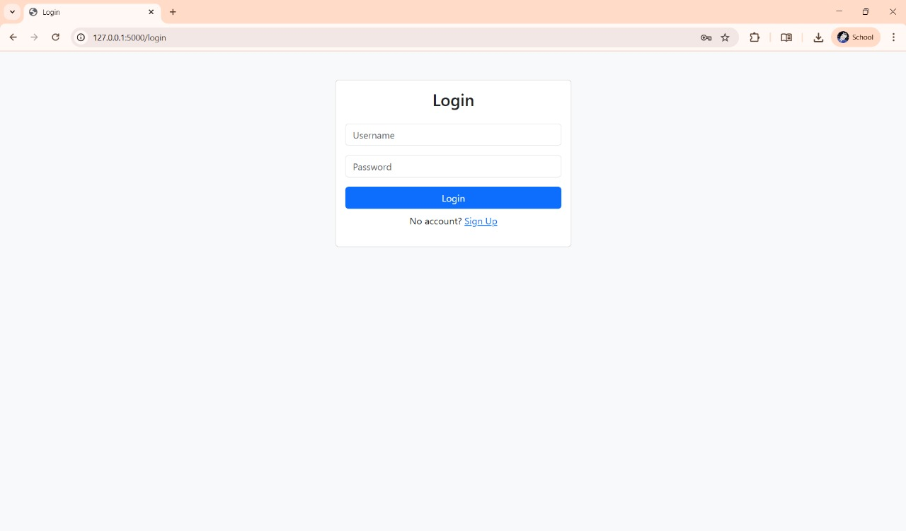
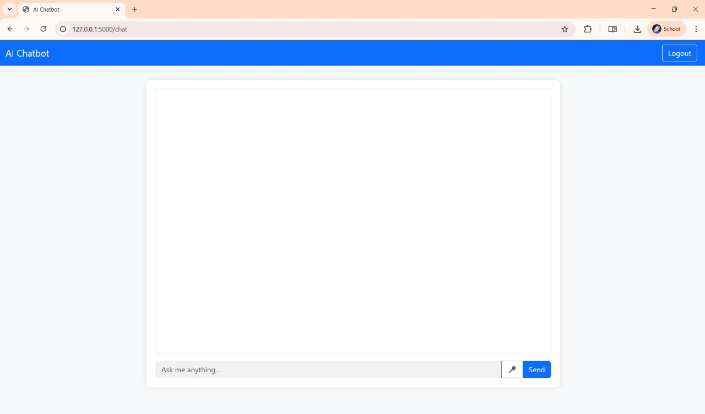

# Real-Time AI Chatbot using OpenRouter API

This is a real-time AI chatbot built with **Flask**, **SQLite**, and the **OpenRouter API**.  
It allows users to **sign up**, **log in**, and chat with an AI powered by **LLaMA-3**.  
The chat history is stored in a local database, and the UI is built with **Bootstrap** for a clean look.  
You can also use **voice input** to talk to the bot.

---

## 🚀 Features
- User sign up and login system (SQLite)
- Real-time chat with AI using **OpenRouter API**
- HTML-formatted AI responses (with code blocks, lists, tables, etc.)
- Save and display chat history for each user
- Simple and responsive UI with Bootstrap
- Voice-to-text input (Speech Recognition API)
- Logout and session management

---

## 📂 Project Structure
```
.
├── app.py               # Main Flask backend
├── requirements.txt     # Python dependencies
├── chatbot.db           # SQLite database (auto-created on first run)
├── templates/           # HTML files for UI
│   ├── login.html
│   ├── signup.html
│   ├── chat.html
│   └── index.html
```

---

## 🛠️ Requirements
- Python 3.8 or higher
- A free [OpenRouter API key](https://openrouter.ai/)
- Basic knowledge of running Flask apps

---

## ⚙️ Setup & Installation

1️⃣ **Clone the repository**
```bash
git clone https://github.com/yourusername/realtime-chatbot-openrouter.git
cd realtime-chatbot-openrouter
```

2️⃣ **Install dependencies**
```bash
pip install -r requirements.txt
```

3️⃣ **Set your environment variables**
```bash
# On Linux/Mac
export API_KEY="your_openrouter_api_key"
export SECRET_KEY="your_secret_key"

# On Windows (CMD)
set API_KEY=your_openrouter_api_key
set SECRET_KEY=your_secret_key
```

4️⃣ **Run the application**
```bash
python app.py
```

5️⃣ **Open the chatbot in your browser**
```
http://localhost:10000
```

---

## 🌍 Deployment (Optional)
You can deploy this app on **Render**, **Railway**, or **Heroku**:
- Make sure to set `API_KEY` and `SECRET_KEY` in the platform's environment settings.
- Use `gunicorn` as the web server:
```bash
gunicorn app:app --bind 0.0.0.0:$PORT
```

---

## 📝 Notes
- Replace `"your_openrouter_api_key"` with your actual API key from OpenRouter.
- The `chatbot.db` file will be created automatically.
- You can change the AI model in `app.py` inside the `query_openrouter()` function.

---

## 📸 Screenshots
### Login Page


### Chat Interface


---

## 📜 License
This project is open-source and free to use.

---

## ❤️ Credits
- [Flask](https://flask.palletsprojects.com/)
- [Bootstrap](https://getbootstrap.com/)
- [OpenRouter](https://openrouter.ai/)
